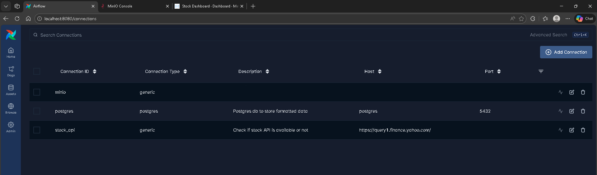
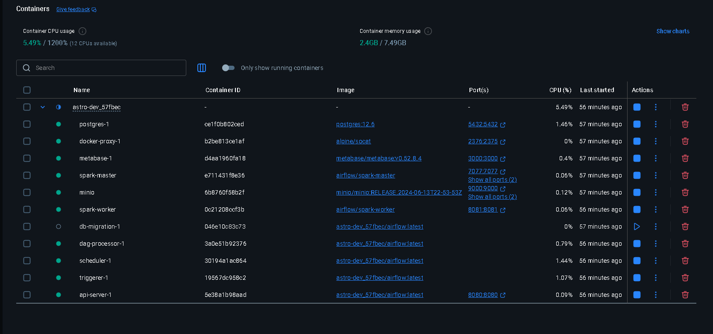
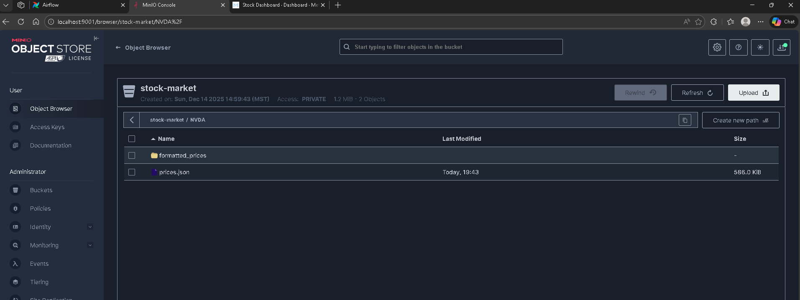
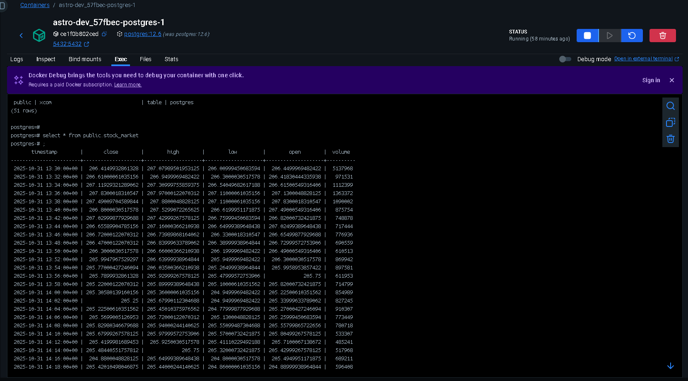

# 📈 Stock Market ETL Pipeline using Apache Airflow (Dockerized)

An end-to-end data engineering ETL pipeline built with Apache Airflow, MinIO (S3-compatible object storage), and PostgreSQL, fully containerized using Docker.
The pipeline fetches daily stock prices from an external API, processes and stores intermediate data in object storage, and loads curated data into a data warehouse for analytics.

## 🔍 Project Motivation

Financial market data is:

Time-sensitive

API-driven

Often requires multi-stage transformation

Needs reliable orchestration and monitoring

This project demonstrates how a real-world production ETL pipeline can be built using industry-standard tools, focusing on:

Workflow orchestration

Cloud-native storage patterns

Data reliability and observability

Clean separation of raw, processed, and curated data

## 🏗️ High-Level Architecture

Technology Stack

Apache Airflow – Workflow orchestration

Docker & Docker Compose – Containerization

MinIO – S3-compatible object storage

PostgreSQL – Data warehouse

Python – API ingestion 

Spark - transformation logic

Metaflow - Dashboarding

## Airflow DAG

## Infrastructure Overview

🔄 Data Pipeline Flow
DAG: stock_market

The pipeline executes the following steps:

Step	Task	Description
1	is_api_available	Sensor checks if the stock API endpoint is reachable
2	get_stock_prices	Fetches stock price data (example: NVDA)
3	store_prices	Stores raw API response in MinIO
4	format_prices	Cleans and structures the raw data
5	get_formatted_csv	Converts processed data into CSV format
6	load_to_dw	Loads final data into PostgreSQL

## 🧠 Key Design Decisions

### ✅ Sensor-based API validation

    Prevents unnecessary failures

    Ensures downstream tasks only run when data is available

### ✅ Object storage (MinIO) for intermediate data

    Decouples ingestion from transformation

    Enables reprocessing without re-calling the API

    Mimics real cloud S3 architectures

### ✅ Dockerized environment

    Ensures reproducibility

    Easy local setup

    Matches production-like workflows

## 🧩 Airflow Connections Configuration

Connections Used
1️⃣ Stock API (stock_api)

Type: HTTP

Stores API host, endpoint, and headers

Accessed dynamically using BaseHook

2️⃣ MinIO (S3 Compatible)

Uses AWS connection type

Custom endpoint pointing to MinIO

Enables use of S3ToSqlOperator

3️⃣ PostgreSQL (Data Warehouse)

Stores curated stock price data

Used as final analytical storage

🪣 Object Storage – MinIO

Bucket Structure

stock-market/

├── raw/
│   └── stock_prices_YYYY-MM-DD.json

├── processed/
│   └── stock_prices_YYYY-MM-DD.csv

This structure mirrors medallion architecture principles:

Raw → immutable API data

Processed → cleaned, analytics-ready datasets

🗄️ Data Warehouse – PostgreSQL

Example table schema:

CREATE TABLE stock_prices (
  symbol TEXT,
  price NUMERIC,
  currency TEXT,
  timestamp TIMESTAMP,
  ingest_date DATE
);

The table is populated automatically via Airflow’s S3ToSqlOperator.

🐳 Dockerized Setup
Services

Airflow Webserver

Airflow Scheduler

MinIO

PostgreSQL

Start the project
docker compose up -d --build

Access UIs
Service	URL
Airflow	http://localhost:8080

MinIO	http://localhost:9001

Postgres	localhost:5432

### 📌 What This Project Demonstrates

✔ Real-world Airflow DAG design
✔ API-based data ingestion
✔ S3-compatible object storage usage
✔ Dockerized data engineering workflows
✔ Warehouse loading patterns
✔ Production-style ETL orchestration

### 🚀 Future Enhancements

Add data quality checks (Great Expectations)

Partitioned warehouse tables

Backfill support

Alerting via Slack/Email

Schema evolution handling

CI/CD for DAG deployment

## 👨‍💻 Author

Prathik Bharath Jain

Data Engineer | Data Scientist | Software Engineer

MS in Data Science – University of Colorado Boulder